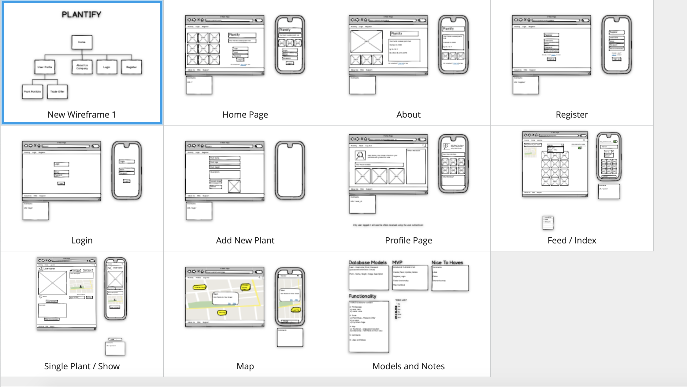
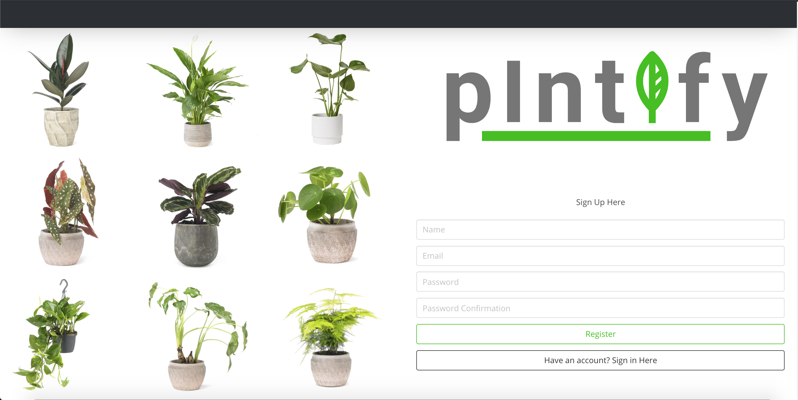
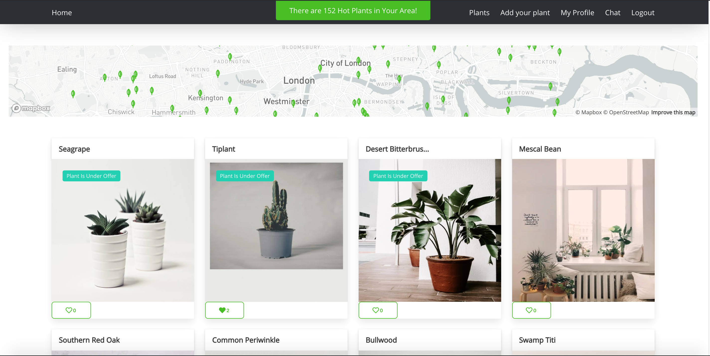
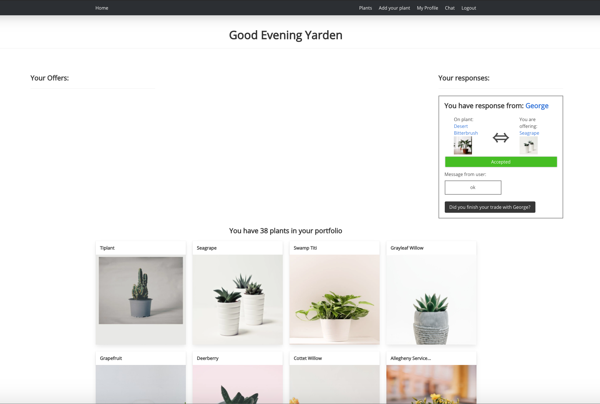
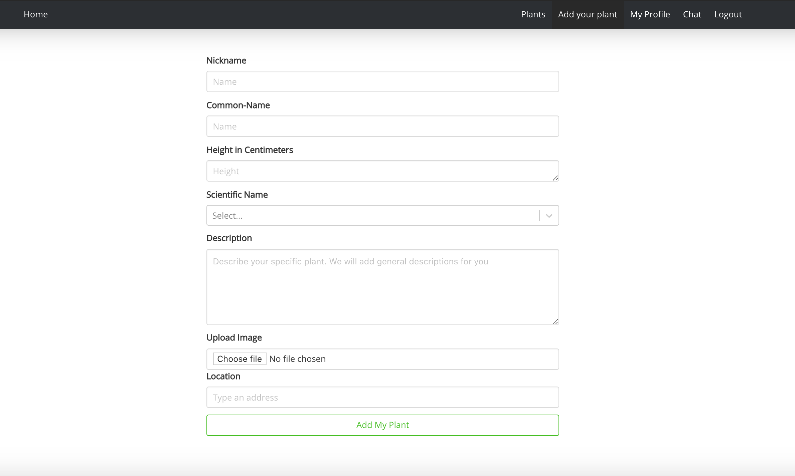
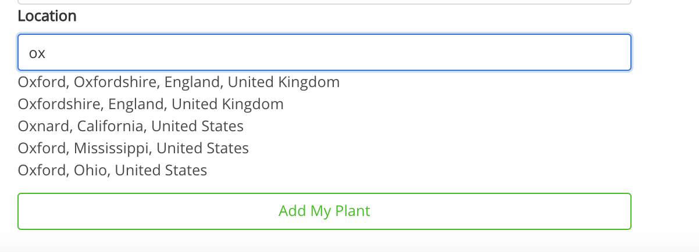
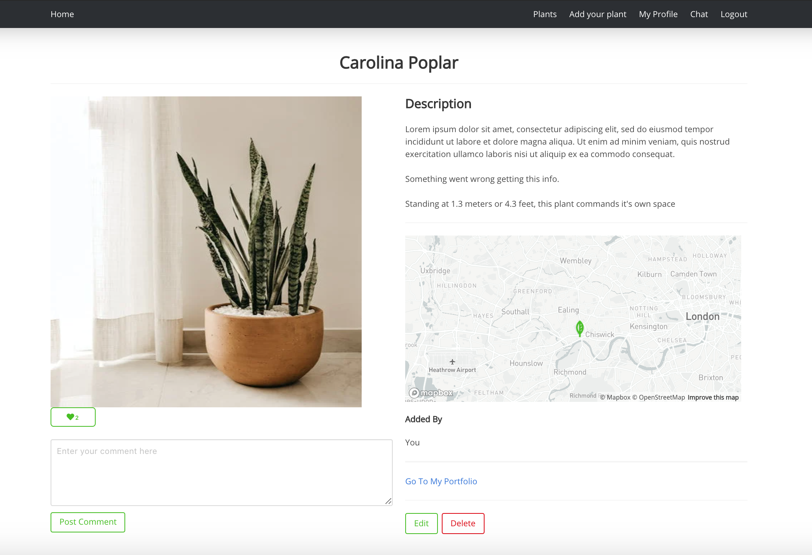
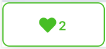
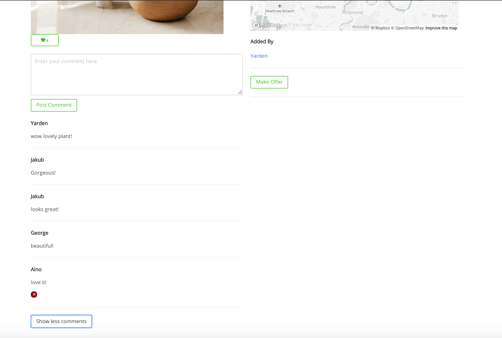
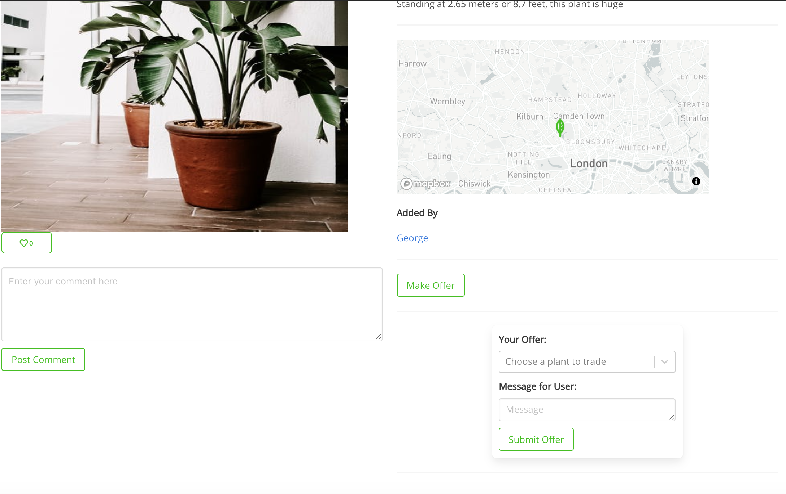

# Project 3: plntify


## Overview

A plant trading social app. 
The time frame for this group project was a week. Our group was made up of 4 members.

Each user has their own portfolio of plants that is diplayed on their profile page.

The users are able to use the interactive map to see other plant's locations. Users are also able to add their own plant's location when they add a plant or edit their plant. 
A map thumbnail with a marker for the plant's location is also displayed on each plant page.

There is a trade feature where users are able to offer a plant from their portfolio in exchange for another user's plant. The user who receives this offer is able to accept or decline. The user who made the offer is able to see their offer's status via their profile page.

Users are able to like and comment on other user's plants, as well as being able to communicate through a private chat.

## Team

* [Aino Kytölä](https://github.com/ainokyto)
* [George Jones](https://github.com/Jompra) 
* [Jakub Horun](https://github.com/ykbhrn)

## Deployment

The website is deployed on Heroku and can be found [here](http://plntify-app.herokuapp.com/)

(After one hour of inactivity Heroku puts the dyno to sleep. The first request may be be wakening it up again and so the first request the router sends will have some delay).

## Built With

* React
* Express
* Node.js
* MongoDB
* Sass
* Axios 
* Bulma
* Git
* GitHub
* Mapbox API
* Trefle API
* Cloudinary
* Pexels API
* Moderation API

## Getting Started

To download the source code click the clone button. Run the following commands in the terminal:

* To install all packages listed in the package.json:
```terminal
npm i
```

* To run the app in your localhost:
* In both front and back:
```terminal
npm run start
```

## Brief

* **Build a full-stack application** by making your own backend and your own front-end
* **Use an Express API** to serve your data from a Mongo database
* **Consume your API with a separate front-end** built with React
* **Be a complete product** which most likely means multiple relationships and CRUD functionality for at least a couple of models
* **Implement thoughtful user stories/wireframes** that are significant enough to help you know which features are core MVP and which you can cut
* **Have a visually impressive design** to kick your portfolio up a notch and have something to wow future clients & employers. **ALLOW** time for this.
* **Be deployed online** so it's publicly accessible.

## Website Architecture

### Wireframe

* Link to our [wireframe](https://balsamiq.cloud/siy86e/pgk0p3q/r7402)


The main components are the home page, index page, profile page, plant page. Users are also able to interact with the map through the home/index page and through the map thumbnail on each plant page. Trade and chat are accessed through the user's profile page. The user can also check their chat inbox through the navbar.

I will give an overview of the app's architecture and delve into more detail on some of the features I built.

## Home 

### Register & Login

When first loading the page, if the user has not registered and logged in, they are met with this page. 
We chose to do this as users can only really interact with the app once they have created an account and a portfolio. The navbar items are completely hidden until the user registers and logs in.



### Index

Once the user has registerd and logged in, the index page also doubles as the home page. The user gains acess to all of the app's features. All items in the navbar become visible.



### Profile Page

The user is greeted with a welcome message that changes according to the time of day. Here the user is able to view their portfolio, offers and responses.



### Create Plant



When the user adds a new plant to their portfolio they are able to add it's 'Nickname', 'Common-Name' (which prompts the 'Scientific Name'), 'Height in Centimeters', 'Description',  'Upload Image'.  Finally they are able to use the auto-complete location search input to enter the plant's address to fill in the 'Location'.

super(props) is called here before any other statement as otherwise this.props would be undefined in the constructor. Additionally I am binding the handleSearchChange and the handleItemClicked. assigning the initial state to this.state directly in the constructor.

This was done using the MapBox GL API.

The parent component NewPlant.js (also EditPlant). Here the location array is being passed the object containing two keys and values for lat and lon.

```javascript
class NewPlant extends React.Component {
  constructor(props) {
    super(props)
    this.state = {
      formData: { //* our formData in state, matches the object we need to send in the request
        name: '',
        imageUrl: '',
        description: '',
        height: '',
        nickName: '',
        units: '',
        location: []
      },
      options: [],
      errors: {
        name: '',
        imageUrl: '',
        description: '',
        height: '',
        nickName: '',
        location: ''
      }, // * an object to store any errors that could occur when making the request.
      place: null
    }
    this.handleSelect = this.handleSelect.bind(this)
  }
  handleSelect(lat, lon) {
    const formData = { 
      ...this.state.formData, location: [{lat: lat, lon: lon}]
    }
    this.setState({ formData })
    // console.log('parent', this.state.formData.location)
  }
```

```javascript
         <FormPlant
            formData={this.state.formData}
            errors={this.state.errors}
            handleChange={this.handleChange}
            handleSubmit={this.handleSubmit}
            onSelect={this.handleSelect}
            handleSelectChange={this.handleSelectChange}
            handleUnitsSelectChange={this.handleUnitsSelectChange}
            imageUrl={this.setImgUrl}
            buttonText="Add My Plant"
          />
```
The FormPlant is called on in the render of NewPlant & EditPlant. The above props are passed down.

```javascript
 class FormPlant extends React.Component {
  constructor(props) {
    super(props)
    this.state = {
      options: [],
      search: '',
      results: [],
      isLoading: false,
      lon: '',
      lat: '',
      test: '',
      errors: {},
    }
    this.handleSearchChange = this.handleSearchChange.bind(this)
    this.handleItemClicked = this.handleItemClicked.bind(this)
  }

  handleSearchChange(e) {
    this.setState({
      search: e.target.value,
      isLoading: true
    })

    // Stop the previous setTimeout if there is one in progress
    clearTimeout(this.timeoutId)

    // Launch a new request in 1000ms
    this.timeoutId = setTimeout(() => {
      this.performSearch()
    }, 1000)
  }
  performSearch() {
    if (this.state.search === "") {
      this.setState({
        results: [],
        isLoading: false
      })
      return
    }
    axios.get(`https://api.mapbox.com/geocoding/v5/mapbox.places/${this.state.search}.json?access_token=${mapBoxKey}`)
      .then(response => {
        this.setState({
          results: response.data.features,

          isLoading: false
        })
      })
  }
  handleItemClicked = async (place) => {

    const search = await place.place_name
    const lon = await place.geometry.coordinates[0]
    const lat = await place.geometry.coordinates[1]
    this.setState({
      lat: lat,
      lon: lon,
      search: search,
      results: []
    })
    // console.log(this.state)
    this.props.onSelect(lat, lon)

  }
```

The address is condensed into lattitude and longitude. This was done to translate to the map and place the marker on the map thumbnail.



```javascript
       <div className="field">
            <label className="label">Location</label>
            <div className={`control ${errors.description ? 'is-danger' : ''}`}>
              <div className="AutocompletePlace">
                <input
                  className="input AutocompletePlace-input" type="text" value={this.state.search} onChange={this.handleSearchChange} placeholder="Type an address"
                />
                <ul className="AutocompletePlace-results">
                  {this.state.results.map(place => (
                    <li
                      key={place.id}
                      className="AutocompletePlace-items"
                      onClick={() => this.handleItemClicked(place)}
                    >
                      {place.place_name}
                    </li>
                  ))}
                  {this.state.isLoading && <li className="AutocompletePlace-items">Loading...</li>}
                </ul>
```

### Plant Page



### Map Thumbnail

I built the map thumbnail as a separate component. That way it could be easily imported and used anywhere on the app so long as it has an object passed down as props. This component passes the props to the lat and lon. The value for the lat and lon is assigned when a plant is added or edited.

```javascript
import React from 'react'
import { Link } from 'react-router-dom'
import MapGl, { Marker } from 'react-map-gl' // The map component
import 'mapbox-gl/dist/mapbox-gl.css' // any CSS styling needed to make the map work
const token = process.env.REACT_APP_MAPBOX_TOKEN

const PlantMapThumbnail = (props) => {
  return (
    <>
      <div>
        <Link to={{
          pathname: '/maps',
          state: {
            latitude: parseFloat(props.lat),
            longitude: parseFloat(props.lon),
            plantProps: {
              id: props._id,
              name: props.name,
              nickName: props.nickName,
              imageUrl: props.imageUrl
            }
          }
        }} >
          <MapGl
            mapboxApiAccessToken={token}
            height={'30vh'}
            width={'30vw'}
            mapStyle='mapbox://styles/mapbox/light-v10'
            latitude={parseFloat(props.lat)}
            longitude={parseFloat(props.lon)}
            zoom={10}
          >
            <div key={props._id}>
              <Marker
                latitude={parseFloat(props.lat)}
                longitude={parseFloat(props.lon)}
              >
                
              </Marker>
            </div>
          </MapGl>
        </Link>
      </div>
    </>
  )
}

export default PlantMapThumbnail
```

The PlantMapThumbnail is called on in the ShowPlant component. The props are passed down to the lat and lon from the address entered in the auto-complete location search input in the add plant/edit plant page.

```javascript
     <PlantMapThumbnail
                _id={plant._id}
                lat={plant.location[0].lat}
                lon={plant.location[0].lon}
                name={plant.name}
                nickName={plant.nickName}
                imageUrl={plant.imageUrl}
              />
```

### Likes 

Users are able to like and unlike plants from the index page and on the plant page.

#### Back: 

__Schema__

Likes are added as an array into the plantSchema. The array contains the userId and username. This will later be used to identify which user is liking the plant and which user is receiving the like on their plant.

```javascript
const plantSchema = new mongoose.Schema({
... 
  likes: [{ userId: String, username: String }, {  required: false  }], 
...
```

__Routes__
```javscript
router.route('/likes')
  .post(secureRoute, like.like)
```

__Controllers__

```javascript
const Plant = require('../models/plant')

async function like(req, res) {
  try {
    const user = req.currentUser //* from secureRoute
    const plant = await Plant.findById(req.body.plantId) //* querying database and requesting body with plantId -> sent via post method in routes with the body of the request

    let likes = plant.likes //* making a copy so we are not working on the original
    //* creating a variable for the like status, the default is false
    let likeStatus = false
    //* filtering the likes so we can receive a new array containing only the logged in user likes
    const likeCheck = likes.filter(like => like.userId === user._id.toString()) 
    //* this if statement checks if the user actually liked this plant
    if (likeCheck.length > 0) {
      //* if true we will remove the like as the user should only be able to like the same plant once
      //* by generating a new like array using the filter which excludes the current user and therefore removing the like
      likes = likes.filter(like => like.userId !== user._id.toString())
      //* else if this user has yet to like this plant
    } else {
      //* if a like is made the variable likeStatus is made true
      likeStatus = true
      //* we then include the userDetails and push them into the likes array
      const userDetails = { userId: user._id, username: user.name }
      likes.push(userDetails)
    }
    //* finished working on the copy and can now assign it back to the original plant.likes
    plant.likes = likes
    const updatedPlant = await plant.save()
    //* after saving we return the updatedPlant which returns the promise -> await plant.save() --> updatedPlant which is the plant only updated with or without the like
    //* sending a json compiled of likeStatus, likeCount and allf of the plant updated data
    const data = { likeStatus: likeStatus, likeCount: updatedPlant.likes.length, plantData: updatedPlant }
    res.status(200).json(data) //* update status
  } catch (err) {
    res.stauts(500).json(err)
  }
}

//* In short the user can "like" and "unlike"

module.exports = {
  like //* same as like: like
}
```

#### Front:  

I made the likes component independent so that it could be called on and used anywhere on the app. 

```javascript
const Plant = require('../models/plant')

async function like(req, res) {
  try {
    const user = req.currentUser //* from secureRoute
    const plant = await Plant.findById(req.body.plantId) //* querying database and requesting body with plantId -> sent via post method in routes with the body of the request

    let likes = plant.likes //* making a copy so we are not working on the original
    //* creating a variable for the like status, the default is false
    let likeStatus = false
    //* filtering the likes so we can receive a new array containing only the logged in user likes
    const likeCheck = likes.filter(like => like.userId === user._id.toString()) 
    //* this if statement checks if the user actually liked this plant
    if (likeCheck.length > 0) {
      //* if true we will remove the like as the user should only be able to like the same plant once
      //* by generating a new like array using the filter which excludes the current user and therefore removing the like
      likes = likes.filter(like => like.userId !== user._id.toString())
      //* else if this user has yet to like this plant
    } else {
      //* if a like is made the variable likeStatus is made true
      likeStatus = true
      //* we then include the userDetails and push them into the likes array
      const userDetails = { userId: user._id, username: user.name }
      likes.push(userDetails)
    }
    //* finished working on the copy and can now assign it back to the original plant.likes
    plant.likes = likes
    const updatedPlant = await plant.save()
    //* after saving we return the updatedPlant which returns the promise -> await plant.save() --> updatedPlant which is the plant only updated with or without the like
    //* sending a json compiled of likeStatus, likeCount and allf of the plant updated data
    const data = { likeStatus: likeStatus, likeCount: updatedPlant.likes.length, plantData: updatedPlant }
    res.status(200).json(data) //* update status
  } catch (err) {
    res.stauts(500).json(err)
  }
}

//* In short the user can "like" and "unlike"

module.exports = {
  like //* same as like: like
}
```

In our app the likes component is called on in the cardPlant component and is therefore displayed in the index page. It is also called on in the ShowPlant component and therefore each plant page. 

Likes component being called on in the ShowPlant component: 
```javascript
     <Likes
                likes={plant.likes}
                plantId={plant._id}
              />
```



### Comments

Users are able to comment on plants on each plant page.

#### Back: 

__Schema__

```javascript
//* each comment has to fit this schema criteria
const commentSchema = new mongoose.Schema({
  text: { type: String, required: true },
  user: { type: mongoose.Schema.ObjectId, ref: 'User', required: true }
}, {
  timestamps: true
})
```

```javascript
const plantSchema = new mongoose.Schema({
... 
  comments: [commentSchema],
...
```

__Routes__

```javascript
router.route('/plants/:id/comments')
  .post(secureRoute, plants.commentCreate)  

router.route('/plants/:id/comments/:commentid')
  .delete(secureRoute, plants.commentDelete) 
```

__Controllers__

```javascript
// * POST - body = { a valid comment object }
// * URL - api/plants/:id/comments
async function plantsCommentCreate(req, res, next) {
  console.log('comment created')
  try {
    // * Find the plant that we are creating a comment on
    req.body.user = req.currentUser
    const plantId = req.params.id
    const plant = await Plant.findById(plantId)
    if (!plant) throw new Error('notFound')
    // * attach our comment object(sent in the request body) to that plant, pushing into its comments array
    plant.comments.push(req.body)
    console.log(plant)
    console.log(req.body)
    // * resave that plant with the new comments
    await plant.save()
    // * send back that plant in response, with new comment present
    res.status(201).json(plant)
  } catch (err) {
    next(err)
  }
}

// * DELETE 
// * URL = /plants/:id/comments/commentId
async function plantsCommentDelete(req, res) {
  try {
    // * find the plant to delete the comment from, find by id
    const user = req.currentUser._id
    const plantId = req.params.id
    const commentId = req.params.commentid

    const plant = await Plant.findById(plantId)
    if (!plant) throw new Error({ message: 'not found' })

    const commentToRemove = plant.comments.id(commentId)
    if (!commentToRemove) throw new Error({ message: 'notFound' })

    //* need toString the user in order to use the id. Checking to see if the user logged in matches the owner of the comment for security. If not Throw Error
    if (user.toString() !== commentToRemove.user.toString()) throw new Error({ message: 'not found' })

    await commentToRemove.remove()
    // * resave it again, with that comment deleted

    await plant.save()
    // * send no content to signfy deletion is complete

    res.sendStatus(204)
  } catch (err) {
    res.json(err.data)
  }
}
```

#### Front: 

__Add comment__

```javascript
//* COMMENTS
  commentHandleChange = event => {
    const text = event.target.value //* saving what the user types into the comment box
    this.setState({ text }) //* setting state with their comment
  }

  commentHandleSubmit = async event => {
    event.preventDefault()
    const plantId = this.props.plantId
    try {
      await addComment({ text: this.state.text }, plantId) //* the add comment function requires a text field so you can pass it through like so - also it needs to match the order that you're using the arguments in your api.js file
      this.setState({ text: '' }) //* setting the comment box back to empty
    } catch (err) {
      console.log(err.response.data)
    }
    this.getData() //* calling this getData function again to reload the page with the new database info and display your new comment straight away!
  }
```

__Delete comment__

```javascript
commentHandleDelete = async event => {
    event.preventDefault()

    try {
      const commentId = event.target.getAttribute('comment-id')
      const plantId = this.state.plant._id
      await deleteComment(plantId, commentId)
    } catch (err) {
      console.log(err)
    }
    this.getData()
  }
```

__Show more/less comments __

```javascript
showMoreCommentsHandleClick = async () => {
    // console.log('showing more')
    // event.preventDefault()
    //* now the rows will be equal to the comments array lenght and all the comments will be shown
    const newRows = this.state.plant.comments.length
    this.setState({ rows: newRows })
    this.getData()

  }

  ShowLessCommentsHandleClick = async () => {
    // console.log('showing less')
    // event.preventDefault()

    const lessRows = '3'
    this.setState({ rows: lessRows })
    this.getData()
  }

  toggleCommentsHandleClick = async event => {
    event.preventDefault()
    const show = this.state.commentsStatus
    // console.log(show) 
    
    if (show) {
      this.setState({ commentsStatus: false , buttonText: 'Show less comments' })
      this.showMoreCommentsHandleClick()
    } else {
      this.setState({ commentsStatus: true , buttonText: 'Show more comments' })
      this.ShowLessCommentsHandleClick()
    }
  }
```




## Trade



## Chat


## Wins

* how well we worked together as a team etc....
* Communication was key
* Also used trello but mainly just discussed during standup every morning and updating each other whenever we were finished with a task or stuck, on zoom and on slack all day.

## Challenges

* full-stack comments and likes....

<!-- ## Bugs
? -->

## Future Improvements

* Fine-tune trade and chat
* Fine-tune styling
* Exapand on social aspect. Followers, favourites
* Add likes to comments
* Index page dropdown to also filter plants by newest, favourites, following, location - through search input.
* An about page that is visible before registering/logging in and after.

## Credits